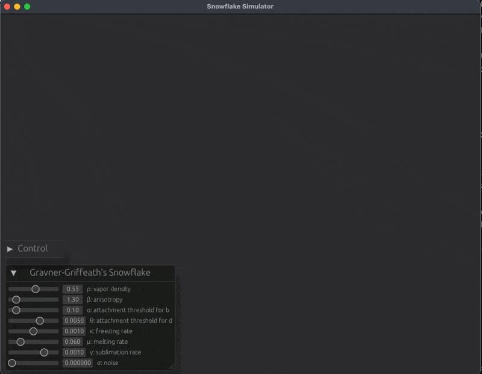

# Snowflake Simulator



----

## Overview

This is a program that simulates the growth of snow crystals. It is written in Rust and operates in a multi-threaded environment. Bevy is used for visualization.

The simulation algorithm implements the one described in reference [1]. While parameters can be dynamically changed during execution, ρ (water vapor density) is only reflected upon reset.

By toggling the comments on L.19 and L.20 in main.rs, you can switch to an implementation using the method from reference [2]. In this case, β (water vapor density) is also only reflected upon reset.

As it's built with Rust and Bevy, it should theoretically be possible to make it run in a web browser with some effort. However, since it uses rayon support for ndarray, that part would need to be modified.

## Usage

```sh
cargo run --release
```

## References

1. Gravner, J., Griffeath, D. (2008). [Modeling snow crystal growth II: A mesoscopic lattice map with plausible dynamics](https://doi.org/10.1016/j.physd.2007.09.008). Physica D: Nonlinear Phenomena, 237(3), 385-404.
2. Reiter, C. A. (2005). [A local cellular model for snow crystal growth](https://doi.org/10.1016/j.chaos.2004.06.071). Chaos, Solitons & Fractals, 23(4), 1111-1119.
