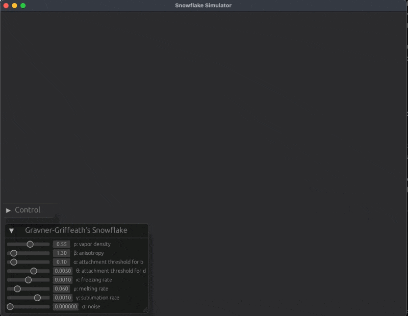

# Snowflake Simulator




Try the interactive simulation in your web browser: [Live Demo](https://yuki.necocen.info/)

----

## Overview

This is a program that simulates the growth of snow crystals. It is written in Rust and operates in a multi-threaded environment. Bevy is used for visualization.

The simulation algorithm implements the one described in reference [1]. While parameters can be dynamically changed during execution, ρ (water vapor density) is only reflected upon reset.

By toggling the comments on L.19 and L.20 in main.rs, you can switch to an implementation using the method from reference [2]. In this case, β (water vapor density) is also only reflected upon reset.

This project is compatible with web browsers when compiled to WebAssembly (requires the nightly version of Rust).

For more details, check out the [Zenn article](https://zenn.dev/galapagos/articles/snowflake-simulator-in-rust) (in Japanese).

## Usage

### Desktop Version
```rust
cargo run --release
```

### Web Version
1. Build the WebAssembly package:
```
rustup run nightly wasm-pack build --target web --release
```
2. When hosting the web version, your server needs to set the following Cross-Origin headers:
```
Cross-Origin-Opener-Policy: same-origin
Cross-Origin-Embedder-Policy: require-corp
```
These headers (COOP/COEP) are required for the application to function properly in web browsers.

### 3D Model

You can export STL file by pressing "Save STL" button on the control panel. The exported file will be placed in your working directory.

")

## References

1. Gravner, J., Griffeath, D. (2008). [Modeling snow crystal growth II: A mesoscopic lattice map with plausible dynamics](https://doi.org/10.1016/j.physd.2007.09.008). Physica D: Nonlinear Phenomena, 237(3), 385-404.
2. Reiter, C. A. (2005). [A local cellular model for snow crystal growth](https://doi.org/10.1016/j.chaos.2004.06.071). Chaos, Solitons & Fractals, 23(4), 1111-1119.
